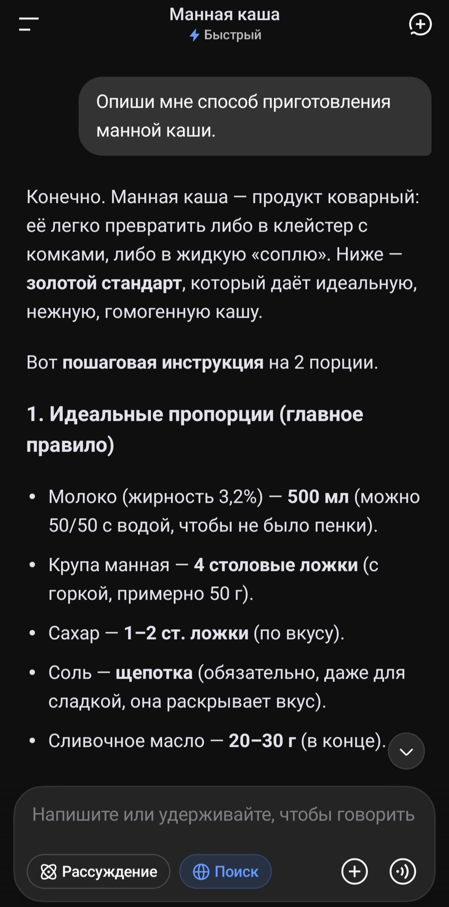
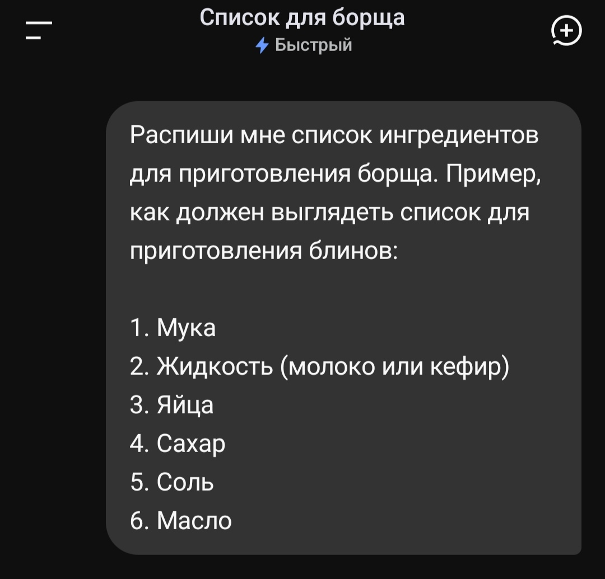
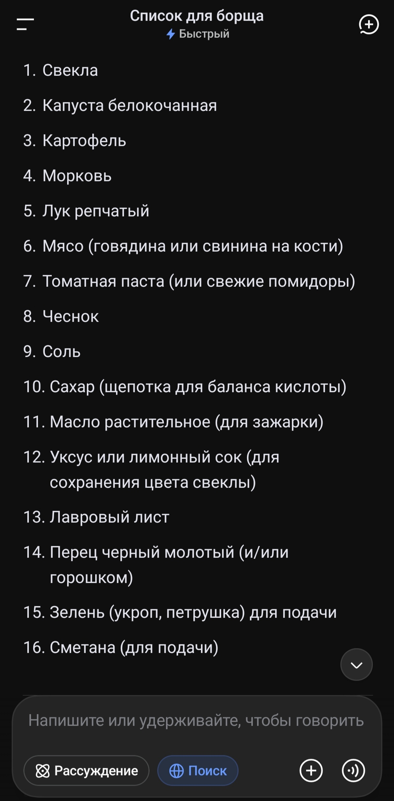
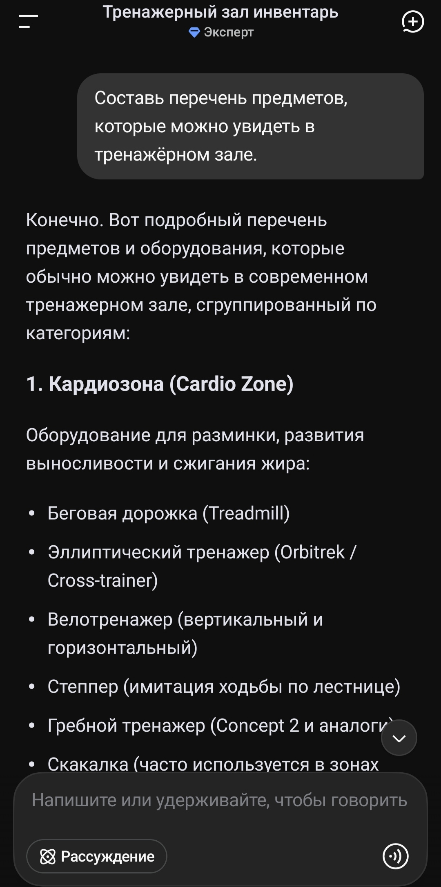
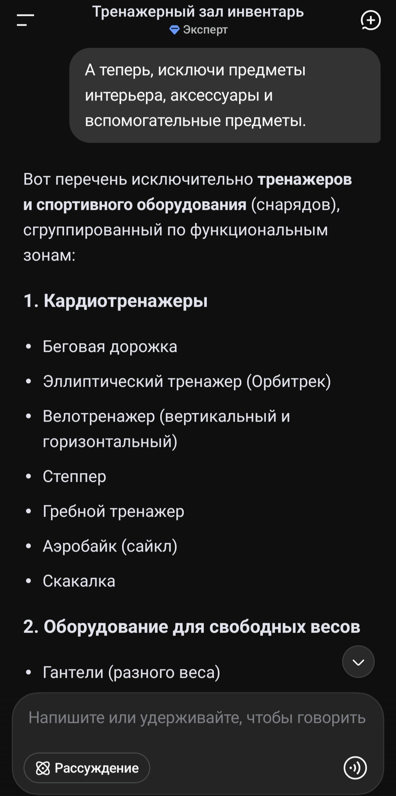

# Инструкция по инженерии запросов для ИИ
## Введение
В 2025 году искусственный интеллект стал повседневным инструментом: он помогает писать тексты, создавать код, генерировать идеи и решать рабочие задачи. Но большинство людей до сих пор не умеют с ним разговаривать. Они получают общие, бесполезные ответы, разочаровываются и перестают использовать ИИ. Проблема не в нейросетях. Проблема в том, что их никто не учил задавать правильные вопросы.

Эта инструкция — практическое руководство для тех, кто хочет научиться формулировать запросы так, чтобы ИИ давал точные, полезные и релевантные ответы. Она основана на личном опыте, изучении курсов и реальных экспериментах с разными ИИ-ассистентами.

## Запросы
Любой разговор с ИИ-ассистентом начинается с **prompt** **(запроса)**. Запросы используются чтобы взаимодействовать с ИИ, для создания ответов. В зависимости от того, насколько запрос подробный, ИИ-ассистент сгенерирует наиболее подходящий для вас результат. Если вы не получили желаемые результат запроса с первого раза - его можно дополнить, добавив больше информации, или спросив по-другому. ИИ (в отличие от поисковых систем вроде Google, Bing) запоминает, о чём вы говорили.  
> [!NOTE]
> При использовании одного и того же запроса, ИИ генерирует разные ответы.

**Конверсационные ИИ‑ассистенты (разговорные)** — это цифровые помощники, которые умеют вести с человеком диалог на естественном языке — в текстовом или голосовом формате. Такие ассистенты не просто выдают заготовленные ответы, а стараются понимать смысл сказанного, учитывать контекст беседы и поддерживать разговор. Примеры ИИ-ассистентов: **ChatGPT**, **Deepseek**, **Gemini**, и т.д.

Чем отличаются от простых чат‑ботов:
- **Понимание контекста** - конверсационный ИИ помнит предыдущие реплики и может к ним возвращаться
- **Гибкость формулировок** - он распознаёт разные способы задать один и тот же вопрос, понимает сленг, опечатки, неполные фразы
- **Умение уточнять** - если запрос неясен, ассистент может задать наводящий вопрос вместо того, чтобы выдать случайный ответ
- **Генерация, а не выбор из шаблонов** - вместо заранее прописанных веток диалога система формирует ответ, опираясь на свои знания и логику

Не весь разговорный ИИ является генеративным. И не весь генеративный ИИ является разговорным. Разговорный ИИ способен писать новый уникальный текст и вести двусторонний диалог, в то время как генеративный ИИ создаёт новый контент (текст, код, картинки, музыку, видео), принимая каждый отдельный запрос.

### Ключевые отличия
|Параметр|Генеративный ИИ|Разговорный ИИ|
|---------|---------------|-------------|
|**Основная цель**|Создать новый артефакт (текст, изображение и т. д.)|Поддержать осмысленный диалог с пользователем|
|**Что на входе**|Промпт/запрос на создание (иногда с ограничениями)|Реплика в контексте беседы, часто неполная или с отсылками к прошлому|
|**Что на выходе**|Готовый контент (статья, картинка, код)|Ответ, который уместен в диалоге (может быть коротким, уточняющим, многоходовым)|
|**Контекст**|Часто работает с одним запросом; контекст задаётся в промпте|Обязательно хранит и использует историю диалога|
|**Управление поведением**|Через промптинг и параметры генерации (температура, длина)|Через сценарии, правила, состояния диалога и политики (безопасность, тон)|
|**Типичные метрики качества**|Релевантность, креативность, соответствие ограничениям, отсутствие галлюцинаций|Понимание намерений, уместность ответа, удержание контекста, удовлетворённость пользователя|

При работе с ИИ, необходимо знать, что неверные или бессмысленные вводные данные приводят к некорректным результатам. Изначальное предоставление необходимого уровня детализации может помочь улучшить качество ответа без необходимости просить ИИ внести изменения. ИИ будет стараться следовать вашим инструкциям. Та же гибкость, которая позволяет ему быть креативным, может также привести к ложной информации, известной как **галлюцинации**. Чтобы снизить риск галлюцинаций, уточняйте запрос, просите ссылки на источники или проверяйте факты

## Дизайн запросов
Существуют четыре основные составляющие хорошего запроса:
- **задача**
- **контекст**
- **примеры**
- **формат**

**Задача** - это то, что вы хотите, чтобы **большая языковая модель** (**Large Language Model** или **LLM**) непосредственно выполнила. **LLM** способна выполнить только конкретный запрос, без прогнозирования.

**Контекст** - это важные детали второго плана. Пример: "_Перечислите несколько идей для досуга_" не имеет контекста, в то время как запрос "_Перечислите несколько идей для досуга на вечер пятницы_" несёт его в себе. 
Для **LLM** вы также можете назначить роль (например фитнес-тренера), чтобы получить более точные и релевантные ответы. Пример: "_Как фитнес-тренер, порекомендуйте как распределить нагрузку для разных групп мышц на неделю_".

**Примеры** - это ваши необходимые уточнения, на основе которых **LLM** выдаёт подходящие ответы. Пример: "_Составь программу тренировок на неделю. Описание должно содержать дни тренировок, какие группы мышц задействованы. Например: Понедельник (тренировка мышц ног): приседания со штангой 3 подхода по 10-15 повторений._"

**Формат** - организация ответа в определённом виде (например сценарий фильма, список покупок, или программный код). Пример: "_Составь программу на языке Python для автоматического подсчёта финального результата._"

> [!NOTE]
> Не все запросы требуют всех 4 элементов. Это зависит от задаваемой задачи, и насколько конкретными должны быть ответы.

Вы можете использовать несколько запросов, чтобы продолжать добавлять новую информацию до тех пор, пока не получите нужный результат. Этот разговорный, итеративный процесс называется **побуждением**. Взаимодействуя с ИИ таким образом, люди помогают улучшить качество, точность, и актуальность его выводов. Это улучшение называется **human-in-the-loop**. 

## Техники инженерии запросов
**Инженерия запросов (prompt-engineering)** - это набор методик для получения лучших результатов при использовании запросов.
ИИ способен выполнять задачи, для которых он специально не обучался. Вы можете дать указание ИИ выполнить задачу, которая не встречалась во время обучения.

**Запрос без примеров (zero-shot prompting)** - это запрос, который включает в себя задачу, но не содержит примеров для его выполнения. Таким образом, ИИ способен выполнять некоторые задачи без предварительной подготовки.

_Рисунок 1: Пример запроса без примеров_

**Запрос с несколькими примерами (few-shot prompting)** - это запрос, который включает в себя как минимум один пример желаемого результата. Такой вариант запроса требуется для выполнения более сложных задач. Шаблон с несколькими примерами обучает предварительно обученную модель выполнять задачу и даёт лучшие результаты без необходимости дообучения. **Побуждение** с несколькими примерами предоставляет новые данные для обучения предобученной модели.

_Рисунок 2: Пример запроса с несколькими примерами_

_Рисунок 3: Результат запроса_

Метод **Chain-of-Thought (CoT)** - это техника prompt, которая может улучшить ответ, побуждая ИИ мыслить пошагово и быть более прозрачным в этом процессе. Самый простой способ реализовать Chain-of-Thought prompting — попросить **LLM** мыслить поэтапно. Чтобы улучшить результаты, вы можете направить ИИ, предоставив шаги, необходимые для выполнения задачи. Вы также можете предоставить примеры рассуждений для аналогичных задач. Таким образом вы обучаете модель логике решения определенного типа проблемы.

_Рисунок 4: Первый запрос в технике Chain-of-Thought_

_Рисунок 5: Второй запрос в технике Chain-of-Thought_

## Заключение
**Prompt-инжиниринг** — это не магия, а **навык**. Как любой навык, он требует практики, внимания и готовности пробовать снова, если не получилось с первого раза. 
Главное, что нужно запомнить:
1. Хороший запрос = **задача** + **контекст** + **примеры** + **формат**.
2. Не бойтесь уточнять и переформулировать — ИИ **запоминает** диалог.
3. Ошибки — это не провал, а способ узнать, как **работает** модель.

Теперь, когда вы знаете основы, попробуйте применить их на практике. Начните с простого запроса, добавьте контекст, уточните формат — и посмотрите, как изменится ответ. Чем больше вы практикуетесь, тем точнее и полезнее становятся результаты.
Помните: ИИ — это инструмент, а не волшебная палочка. Чем лучше вы управляете им, тем больше он может вам дать.
